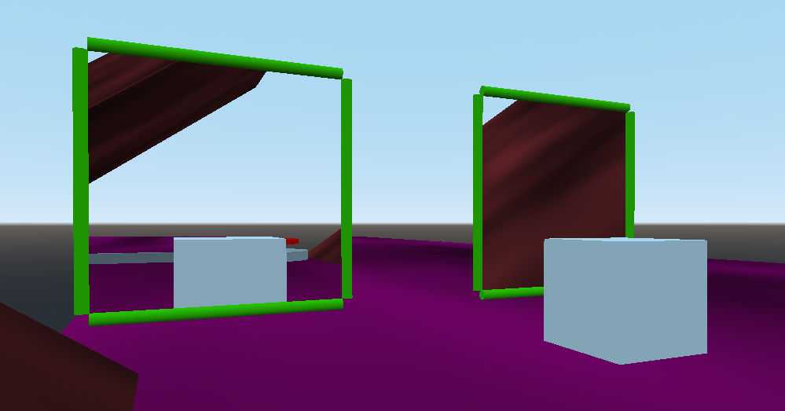

# Godot Portal Demo

Experimenting with portals in Godot Engine

[Web build](https://io12.github.io/godot-portal-demo/)

## Controls

WASD or arrow keys to move, E to pick up cube

## Issues

This implementation has several issues that need to be fixed before
the portals can be fully seamless. To fix all of them, Godot needs
support for [custom projection matrices](https://github.com/godotengine/godot/issues/7499)
and [stencil buffering](https://github.com/godotengine/godot/issues/23721), which
it doesn't have yet.

- Fix holding RigidBody through portal
- Fix performance with stencil buffering
- Oblique near-plane frustum for portal cameras
- Seamless first-person player teleportation
- Mesh culling for objects in portal
- Collision masking for objects behind portal
- Lighting through portals
- Portal camera FOV sync with player FOV
- Portal dynamic updating in editor (optional, but nice)

## How it works

The full details are in the code, but basically, the portals behave as
described below.

### Rendering

Each portal has a camera attached to it, mapped to a `ViewportTexture`
on the linked portal. These cameras move based on the player position
such that angles look realistic.

### Physics

When a `RigidBody` overlaps the portal, it creates a clone at the
other portal. The clone and real object swap once the real object's
center goes behind its portal. This allows somewhat-seamless object
teleportation.
